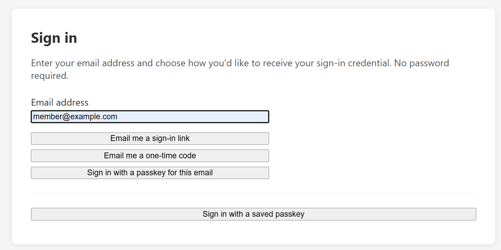

# Getting Started

This guide walks you from a blank Umbraco 13 project to a working passwordless sign-in in about ten minutes.

## Prerequisites

- Umbraco 13 project (net8.0)
- An SMTP server or email delivery service configured in Umbraco (for magic link and OTP)
- Umbraco's distributed cache configured if you plan to use multiple server instances (the default `IDistributedCache` in-memory implementation works fine for single-server deployments)

## Step 1 — Install the NuGet packages

Install only the packages for the factors you want. You can always add more later.

```bash
# Magic link sign-in
dotnet add package HCS.Passwordless.MagicLink

# One-time password sign-in
dotnet add package HCS.Passwordless.Otp

# Passkeys (WebAuthn / FIDO2)
dotnet add package HCS.Passwordless.WebAuthn
```

The `HCS.Passwordless.Core` package is a shared dependency — it installs automatically.

## Step 2 — Register the services

Open `Program.cs` and chain the add-on methods onto your `IUmbracoBuilder`:

```csharp
builder.CreateUmbracoBuilder()
    .AddBackOffice()
    .AddWebsite()
    .AddComposers()
    .AddPasswordlessMagicLink()   // remove if not using magic links
    .AddPasswordlessOtp()         // remove if not using OTP
    .AddPasswordlessWebAuthn()    // remove if not using passkeys
    .Build();
```

You can register any combination. Each method calls `AddPasswordlessCoreOnce()` internally, so core infrastructure is set up exactly once no matter how many add-ons you include.

No other changes to `Program.cs` are needed — the API controllers are automatically discovered.

## Step 3 — Add configuration

Add an `HCS` section to your `appsettings.json`. The minimum you need depends on which factors you're using:

```json
{
  "HCS": {
    "Authentication": {
      "PostLoginRedirectPath": "/member",
      "Notifications": {
        "FromAddress": "noreply@yoursite.com",
        "FromName": "Your Site",
        "Branding": {
          "ProductName": "Your Site"
        }
      },
      "MagicLink": {
        "Enabled": true
      },
      "Otp": {
        "Enabled": true
      },
      "WebAuthn": {
        "Enabled": true,
        "RpId": "yoursite.com",
        "RpName": "Your Site",
        "Origins": [ "https://yoursite.com" ]
      }
    }
  }
}
```

> **Note:** `RpId` and `Origins` are only required for WebAuthn. For local development you can omit them — they default to `localhost` and any origin. See [Passkeys / WebAuthn](webauthn.md) for details.

## Step 4 — Build your login form

The library provides API endpoints but not a login page UI — that's yours to design in Umbraco as normal. The demo site ships a combined form that wires all three methods onto a single email field — here's what it looks like with all three add-ons installed:



Here's a minimal example for magic link:

```html
<form id="magic-link-form">
    <input type="email" name="email" placeholder="your@email.com" required />
    <button type="submit">Send sign-in link</button>
</form>

<script>
document.getElementById('magic-link-form').addEventListener('submit', async (e) => {
    e.preventDefault();
    const email = e.target.email.value;
    await fetch('/auth/magic-link/request', {
        method: 'POST',
        headers: { 'Content-Type': 'application/json', 'RequestVerificationToken': getAntiForgeryToken() },
        body: JSON.stringify({ email, returnUrl: '/member' })
    });
    // Always show "check your email" — never confirm whether the address is registered
    showMessage('Check your inbox for a sign-in link.');
});
</script>
```

See [Magic Link](magic-link.md), [One-Time Passwords](otp.md), and [Passkeys / WebAuthn](webauthn.md) for complete front-end examples for each factor.

## Step 5 — Create at least one member

Passwordless sign-in works with your existing Umbraco members. Make sure the member is **approved** and has a valid email address set in the backoffice. The library looks up members by email address, so a mismatched or missing email will result in the sign-in silently failing.

## Step 6 — Try it

1. Start your site
2. Navigate to your login page
3. Enter the member's email address and submit
4. Check your inbox (or spam) for the sign-in email
5. Click the link (magic link) or enter the code (OTP)

If it doesn't work, check:

- Umbraco's email delivery is configured and working (test with backoffice notifications)
- The member is approved in the backoffice
- The `FromAddress` in your config is a valid sender address for your SMTP service
- For WebAuthn: your `RpId` and `Origins` match the domain you're running on

## What's next?

- Customise the emails members receive → [Email Templates](email-templates.md)
- Adjust rate limits, token lifespans, and other settings → [Configuration reference](magic-link.md), [OTP configuration](otp.md), [WebAuthn configuration](webauthn.md)
- Understand the security model → [Security](security.md)
- Replace built-in services (e.g. use SMS instead of email for OTP) → [Advanced](advanced.md)
