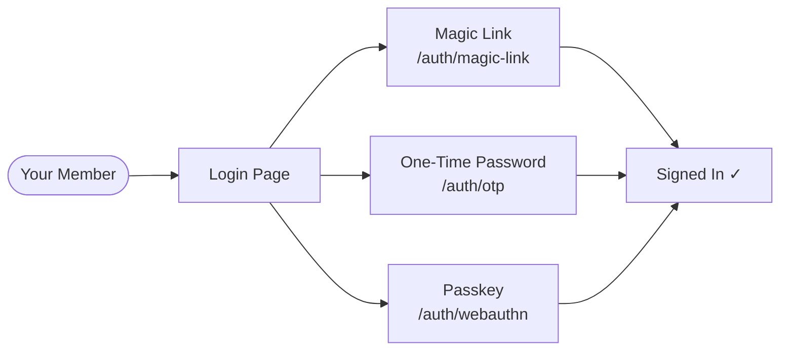

# HCS Passwordless for Umbraco

Welcome! This library adds **passwordless member authentication** to your Umbraco 13 site. Instead of asking your members to create and remember a password, you let them sign in via a magic email link, a one-time code, or a passkey (fingerprint, Face ID, or hardware key).

No passwords means no password resets, no credential stuffing, and no "I forgot my password" support requests. Members get a smoother login experience, and you get a more secure site.

## What's in the box

The library ships as four NuGet packages. You pick the ones you need:

| Package | What it adds |
|---------|-------------|
| `HCS.Passwordless.Core` | Shared infrastructure — installed automatically when you install any add-on |
| `HCS.Passwordless.MagicLink` | **Magic link** sign-in via email |
| `HCS.Passwordless.Otp` | **One-time password (OTP)** sign-in via email code |
| `HCS.Passwordless.WebAuthn` | **Passkeys** (FIDO2/WebAuthn) — fingerprint, Face ID, USB security keys |

You can install one, two, or all three add-ons in the same site. They coexist without conflict.

## Quick links

- **[Getting Started](getting-started.md)** — install, wire up, and run your first passwordless sign-in in minutes
- **[Concepts](concepts.md)** — if you're new to passwordless auth, start here
- **[Magic Link](magic-link.md)** — email link authentication, deep dive
- **[One-Time Passwords](otp.md)** — email code authentication, deep dive
- **[Passkeys / WebAuthn](webauthn.md)** — biometric and hardware key authentication, deep dive
- **[Email Templates](email-templates.md)** — customise the emails your members receive
- **[API Reference](api-reference.md)** — full HTTP endpoint reference for all factors
- **[Security](security.md)** — rate limiting, token hashing, timing attack protection, and more
- **[Advanced](advanced.md)** — replacing built-in services and hooking into library events
- **[Multi-Instance Deployments](multi-instance.md)** — Redis and SQL Server replacements for load-balanced setups

## At a glance

All three methods share the same underlying infrastructure: rate limiting, email branding, and `appsettings.json` configuration under the `HCS:Authentication` section.
