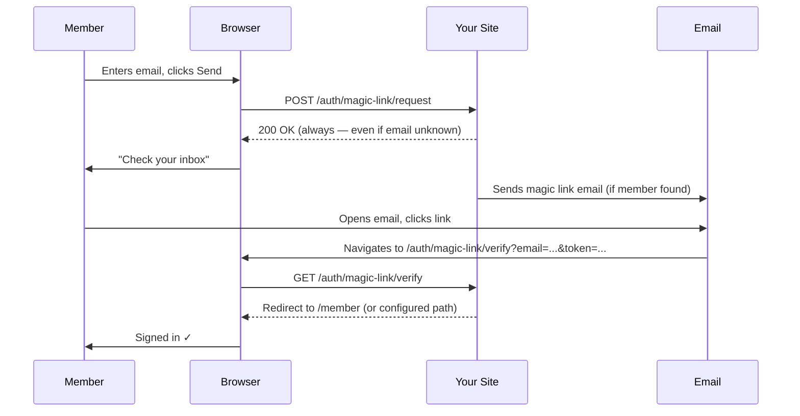
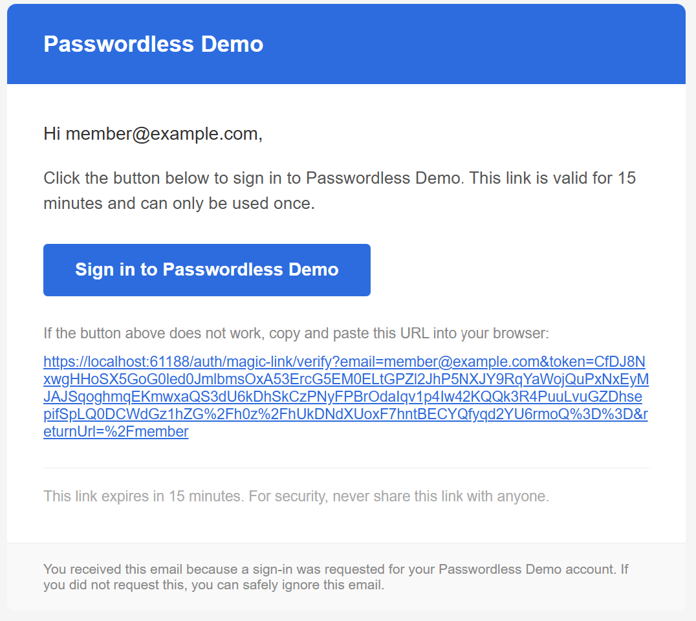

# Magic Link Authentication

A magic link is a one-click sign-in link sent to the member's email address. The member doesn't need to remember a password — their email inbox is the proof of identity.

## How it works



Notice that the server always responds with `200 OK` to the request step, even when the email address isn't registered. This is intentional — it prevents anyone from using the login form to find out which email addresses are registered on your site (a technique called user enumeration).

## The token lifecycle

1. A single-use token is generated via ASP.NET Identity's token provider
2. The token is **hashed** (SHA-256) and the hash is stored in the distributed cache with a TTL matching your configured `TokenLifespan`
3. The original token is embedded in the link sent to the member's inbox
4. When the member clicks the link, the server hashes the received token and checks it against the stored hash
5. If the hashes match and the token hasn't been used before, the member is signed in and the token is marked as consumed
6. Any subsequent click on the same link returns an error — single-use is enforced

## Configuration

All options live under `HCS:Authentication:MagicLink` in `appsettings.json`.

| Key | Type | Default | Description |
|-----|------|---------|-------------|
| `Enabled` | bool | `true` | Set to `false` to disable magic link sign-in entirely |
| `TokenLifespan` | TimeSpan | `00:15:00` | How long the link remains valid. Format: `HH:MM:SS` |
| `SingleUse` | bool | `true` | When `true`, a link can only be used once. Strongly recommended. |

```json
"MagicLink": {
    "Enabled": true,
    "TokenLifespan": "00:15:00",
    "SingleUse": true
}
```

### Shared notification settings

The sender name, email address, email subject, and template path are configured in `HCS:Authentication:Notifications`:

```json
"Notifications": {
    "FromAddress": "noreply@yoursite.com",
    "FromName": "Your Site",
    "MagicLinkSubject": "Your sign-in link",
    "MagicLinkPartial": "Emails/Passwordless/MagicLink",
    "Branding": {
        "ProductName": "Your Site",
        "AccentColor": "#2d6cdf"
    }
}
```

| Key | Default | Description |
|-----|---------|-------------|
| `MagicLinkSubject` | `Your sign-in link` | Subject line of the email |
| `MagicLinkPartial` | `Emails/Passwordless/MagicLink` | Razor partial for the HTML email body |

See [Email Templates](email-templates.md) for how to customise the email design.



## Rate limiting

To prevent abuse, the request endpoint is rate-limited automatically:

- **10 requests per IP per minute** across all endpoints
- **5 requests per email address per hour**

Members who hit the limit receive a `429 Too Many Requests` response. You can adjust these in `HCS:Authentication:RateLimits`. See [Security](security.md) for full details.

## Front-end example

Here's a complete minimal implementation. In practice you'd want to style this to match your site.

### Request form

```html
<!-- Login page -->
<div id="magic-link-section">
    <form id="ml-request-form">
        @Html.AntiForgeryToken()
        <label for="ml-email">Email address</label>
        <input id="ml-email" type="email" name="email" autocomplete="email" required />
        <button type="submit">Send me a sign-in link</button>
    </form>
    <p id="ml-sent" style="display:none">
        ✓ Check your inbox — a sign-in link is on its way.
    </p>
</div>

<script>
document.getElementById('ml-request-form').addEventListener('submit', async function (e) {
    e.preventDefault();
    const email = document.getElementById('ml-email').value;
    const token = document.querySelector('[name=__RequestVerificationToken]').value;

    await fetch('/auth/magic-link/request', {
        method: 'POST',
        headers: {
            'Content-Type': 'application/json',
            'RequestVerificationToken': token
        },
        body: JSON.stringify({
            email: email,
            returnUrl: '/member'
        })
    });

    // Always show the "check your inbox" message — never reveal if address is registered
    document.getElementById('ml-request-form').style.display = 'none';
    document.getElementById('ml-sent').style.display = '';
});
</script>
```

### Handling errors on the verify redirect

When a token is invalid, expired, or already used, the library redirects back to your `LoginPath` with an `error` query parameter. You can display a friendly message:

```html
@{
    var error = Context.Request.Query["error"].ToString();
    var message = error switch {
        "token_invalid"   => "That sign-in link is invalid. Please request a new one.",
        "token_expired"   => "That sign-in link has expired. Please request a new one.",
        "token_used"      => "That sign-in link has already been used.",
        "member_not_found"=> "We couldn't find an account for that email address.",
        _                 => null
    };
}

@if (message != null)
{
    <div class="alert alert-warning">@message</div>
}
```

## Testing checklist

- [ ] Submit a valid member email — email arrives within a few seconds
- [ ] Click the link — you're signed in and redirected to `PostLoginRedirectPath`
- [ ] Click the same link again — you see an error (`token_used` or similar)
- [ ] Wait for the link to expire then click it — you see an error (`token_expired`)
- [ ] Submit an unregistered email — you see "check your inbox" (no error revealed)
- [ ] Submit the form 6+ times quickly — you get a `429` response
