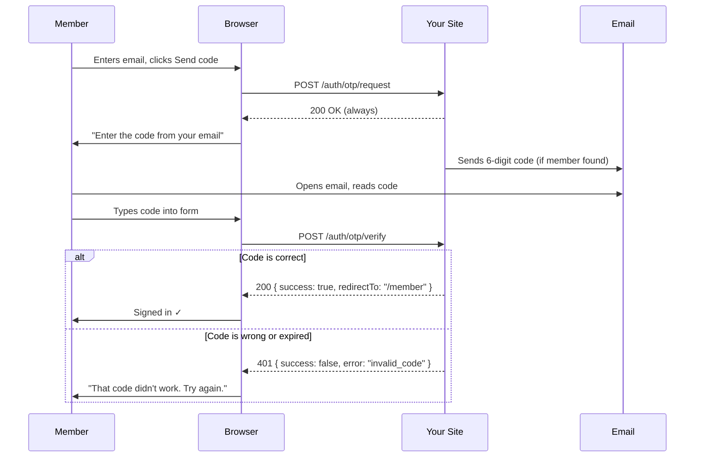
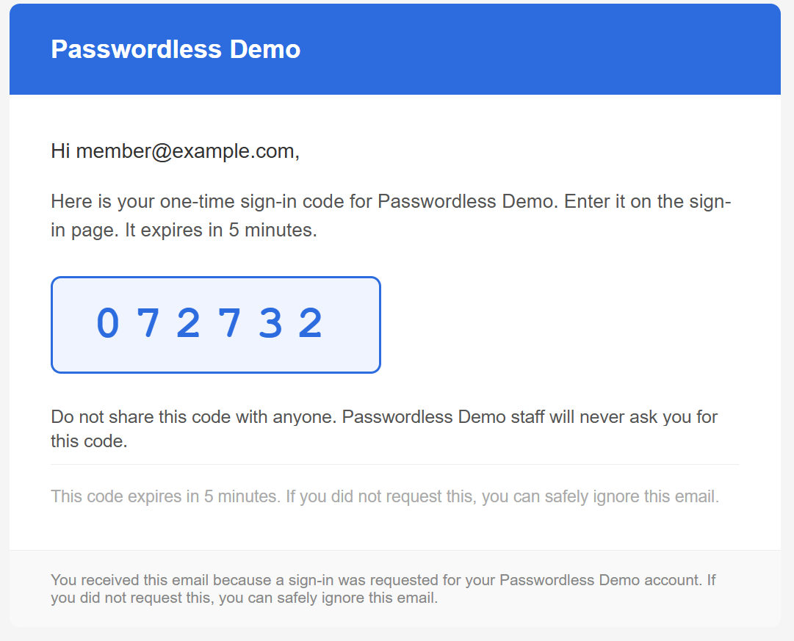

# One-Time Password (OTP) Authentication

OTP authentication sends a short numeric code to the member's email address. The member types the code into a form on your site to sign in. Each code is valid for a few minutes and is single-use — once entered (successfully or not), it's gone.

If you're familiar with two-factor authentication codes from banking apps or other websites, this is the same idea applied as the *primary* sign-in method.

## How it works



Just like magic links, the server always returns `200 OK` to the request step regardless of whether the email address is registered — this prevents user enumeration.

## The code lifecycle

1. A numeric code is generated (6 digits by default, e.g. `847 291`)
2. The code is **hashed** (SHA-256) and stored in the distributed cache with a TTL matching `TokenLifespan`
3. The original code is emailed to the member
4. When the member submits the code, it's hashed and compared — using constant-time comparison to prevent timing attacks
5. If correct: the member is signed in and the stored hash is deleted
6. If incorrect: the attempt counter is incremented. After `MaxAttempts` failures, the member is locked out for `LockoutDuration`
7. After any verification attempt (success or failure), the code is deleted from the store

## Configuration

All options live under `HCS:Authentication:Otp` in `appsettings.json`.

| Key | Type | Default | Description |
|-----|------|---------|-------------|
| `Enabled` | bool | `true` | Set to `false` to disable OTP sign-in entirely |
| `TokenLifespan` | TimeSpan | `00:05:00` | How long the code is valid. Format: `HH:MM:SS` |
| `CodeLength` | int | `6` | Number of digits in the code. Accepted range: 4–10 |
| `MaxAttempts` | int | `5` | Wrong attempts allowed before the member is locked out |
| `LockoutDuration` | TimeSpan | `00:15:00` | How long the lockout lasts after exceeding `MaxAttempts` |
| `NotificationSubject` | string | `Your sign-in code` | Subject line of the OTP email |
| `NotificationPartial` | string | `Emails/Passwordless/Otp` | Razor partial for the HTML email body |

```json
"Otp": {
    "Enabled": true,
    "TokenLifespan": "00:05:00",
    "CodeLength": 6,
    "MaxAttempts": 5,
    "LockoutDuration": "00:15:00",
    "NotificationSubject": "Your sign-in code",
    "NotificationPartial": "Emails/Passwordless/Otp"
}
```

### Shared notification settings

Sender details and branding are configured in `HCS:Authentication:Notifications`. See [Email Templates](email-templates.md) for details.



## Rate limiting

- **10 requests per IP per minute** on the `/request` endpoint
- **5 requests per email per hour** on the `/request` endpoint
- **20 requests per IP per minute** on the `/verify` endpoint (separate from the attempt counter)

The attempt counter and rate limiter work independently. Rate limiting prevents rapid-fire automated requests; the attempt counter locks a specific member after repeated wrong guesses.

## Front-end example

OTP sign-in typically uses two steps: a request form, then a code entry form.

```html
<!-- Step 1: Request form -->
<div id="otp-step-1">
    <form id="otp-request-form">
        @Html.AntiForgeryToken()
        <label for="otp-email">Email address</label>
        <input id="otp-email" type="email" autocomplete="email" required />
        <button type="submit">Send me a code</button>
    </form>
</div>

<!-- Step 2: Code entry form (hidden until step 1 completes) -->
<div id="otp-step-2" style="display:none">
    <p>We've sent a 6-digit code to <strong id="otp-email-display"></strong>.</p>
    <form id="otp-verify-form">
        <label for="otp-code">Enter your code</label>
        <input id="otp-code" type="text" inputmode="numeric" 
               pattern="[0-9]*" autocomplete="one-time-code" 
               maxlength="6" required />
        <button type="submit">Sign in</button>
    </form>
    <p id="otp-error" style="display:none; color:red"></p>
</div>

<script>
let currentEmail = '';
const antiForgery = () => document.querySelector('[name=__RequestVerificationToken]').value;

// Step 1 — Request code
document.getElementById('otp-request-form').addEventListener('submit', async function (e) {
    e.preventDefault();
    currentEmail = document.getElementById('otp-email').value;

    await fetch('/auth/otp/request', {
        method: 'POST',
        headers: { 'Content-Type': 'application/json', 'RequestVerificationToken': antiForgery() },
        body: JSON.stringify({ email: currentEmail, returnUrl: '/member' })
    });

    document.getElementById('otp-step-1').style.display = 'none';
    document.getElementById('otp-email-display').textContent = currentEmail;
    document.getElementById('otp-step-2').style.display = '';
});

// Step 2 — Verify code
document.getElementById('otp-verify-form').addEventListener('submit', async function (e) {
    e.preventDefault();
    const code = document.getElementById('otp-code').value;

    const res = await fetch('/auth/otp/verify', {
        method: 'POST',
        headers: { 'Content-Type': 'application/json', 'RequestVerificationToken': antiForgery() },
        body: JSON.stringify({ email: currentEmail, code, returnUrl: '/member' })
    });

    const data = await res.json();

    if (data.success) {
        window.location.href = data.redirectTo;
    } else {
        const errorEl = document.getElementById('otp-error');
        errorEl.textContent = friendlyError(data.error);
        errorEl.style.display = '';
    }
});

function friendlyError(code) {
    const messages = {
        'invalid_code':    'That code didn\'t work. Check for typos and try again.',
        'expired':         'That code has expired. Request a new one.',
        'locked':          'Too many attempts. Please wait 15 minutes before trying again.',
        'member_not_found':'We couldn\'t find an account for that email address.'
    };
    return messages[code] ?? 'Something went wrong. Please try again.';
}
</script>
```

### Tips for mobile

- Use `inputmode="numeric"` on the code input so mobile devices show the number keyboard
- Use `autocomplete="one-time-code"` to enable SMS/email autofill on supported devices and browsers
- Keep the code length at 6 digits — this is what most people expect from two-factor authentication experiences

## Testing checklist

- [ ] Submit a valid member email — email with a 6-digit code arrives
- [ ] Enter the code correctly — you're signed in
- [ ] Enter the code a second time — it fails (single-use)
- [ ] Enter a wrong code `MaxAttempts` times — subsequent attempts return a locked error
- [ ] After `LockoutDuration`, requesting a new code works again
- [ ] Submit an unregistered email — you see "enter your code" (no error revealed)
